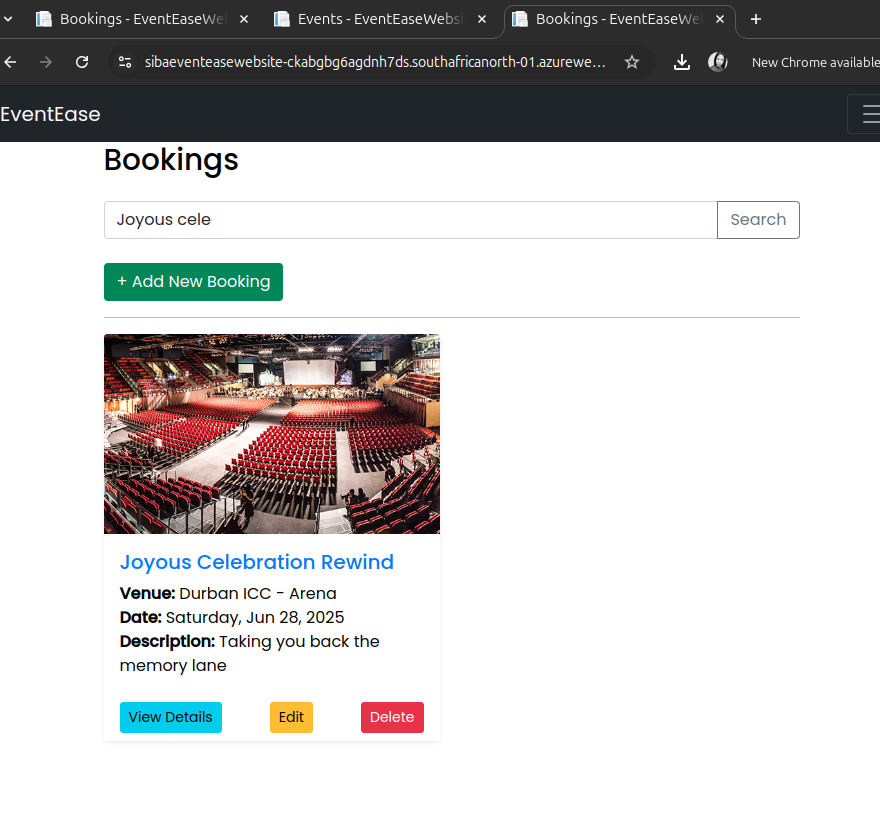

# 🎉 EventEase Venue Booking System – Admin Platform

This is the Admin Portal for EventEaseWebsite, an event management company that coordinates events across multiple venues. The application streamlines venue and event management, prevents booking conflicts, and helps booking specialists handle customer bookings with ease.

---

## 🌐 Live Demo
[Visit Deployed App](https://STxxx.azurewebsites.net)

---

## ✅ Features

### A. Azure Blob Storage
- Upload, view, update, and delete venue and event images
- Images securely stored in Azure Blob Storage

### B. Validation and Error Handling
- Prevents double bookings of the same venue at the same date and time
- Restricts deletion of venues/events with existing bookings
- Displays alerts for validation errors and missing fields
- Application does not crash on missing or incorrect inputs

### C. Enhanced Display and Search
- A combined booking view shows venue, event, and booking data in one place
- Search functionality allows searching by Booking ID or Event Name

### D. Cloud Deployment
- Hosted using Azure App Service
- Azure SQL Database stores all application data
- Azure Blob Storage used for image storage

---

## 💾 Technologies Used

- ASP.NET Core MVC (C#)
- Entity Framework Core
- Azure SQL Database
- Azure Blob Storage
- Azure App Service
- Bootstrap CSS
- Git & GitHub

---

## 📸 Screenshots
### 🗂️ Admin DAshboard
Shows current no. of Venues , events and bookings.

---

### 🗂️ Booking View
Shows event name, venue name, booking ID, date, and other key info.

---

### 🔍 Search Feature
Search for bookings using event name or booking ID.

---

### 🛡️ Validation Alert – Double Booking
Prevents scheduling two events at the same time in the same venue.

---

### 🚫 Deletion Warning
Prevents deletion of events or venues with active bookings.

---

### 📤 Azure Blob Storage Upload
Venue and event images uploaded and stored in Azure.

---

## 🧠 Database Design & Cognitive Search

### 1. Azure Cognitive Search vs Traditional Search
Azure Cognitive Search uses AI to understand context, enabling features like:
- Full-text search with language processing
- Extraction from PDFs, images, and unstructured data

Unlike traditional keyword-based search engines, it understands **user intent** and content relationships.

**Use Cases**:
- Smart website searches
- Enterprise document indexing
- Data insight extraction from logs or scanned files

**Limitations**:
- More costly than basic search
- Requires setup and tuning

**Mitigation**:
- Use free tier for testing
- Leverage prebuilt cognitive skills

📚 *Source*: Microsoft Docs, “What is Azure Cognitive Search?” 
🔗 https://learn.microsoft.com/en-us/azure/search/search-what-is-azure-search

---

### 2. Database Normalization in the Cloud

**Why normalize?**
- Reduces data redundancy
- Ensures data consistency across tables
- Makes updates and queries more efficient

**In cloud environments (like Azure)**:
- Normalized databases scale well and reduce storage costs
- Complex queries may require more joins, so sometimes **partial denormalization** is used for performance

**Impact**:
- Normalized = cleaner, maintainable schema
- Denormalized = faster reads, higher cost for updates

Best practice: **Use normalization for structure, add denormalized views for reporting/performance.**

---

## 🔗 GitHub Repository

[GitHub Link](https://github.com/your-username/eventease-admin-panel)

